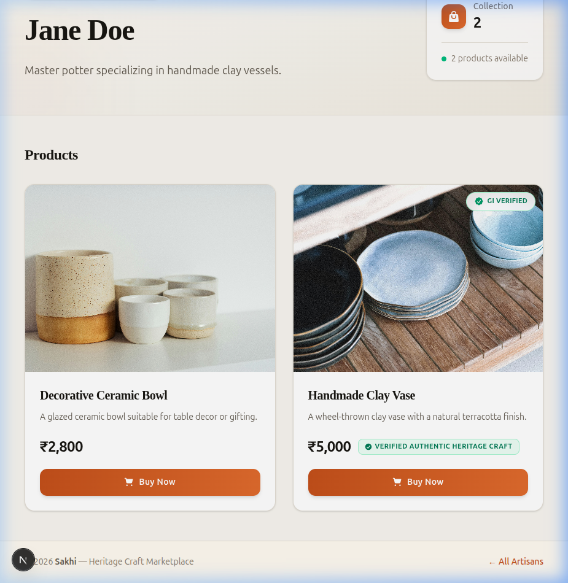

# 🪔 Sakhi — Heritage Craft Marketplace

A modern e-commerce platform connecting India's heritage artisans with conscious buyers. Built with **Next.js 15 (App Router)**, **Tailwind CSS v4**, **Drizzle ORM**, and **Cloudflare D1**.



---

## ✅ What's Been Built

### 🗄️ Database Layer (Drizzle ORM + Cloudflare D1)

| File | Description |
|------|-------------|
| `db/schema.ts` | Drizzle schema with **artisans** and **products** tables |
| `db/index.ts` | Database connection helper — binds Drizzle to Cloudflare D1 via `getRequestContext()` |
| `drizzle.config.ts` | Drizzle Kit config for SQLite migration generation |
| `drizzle/migrations/` | Auto-generated SQL migrations from schema |
| `seed.sql` | Seed data — 4 artisans and 6 products with Unsplash images |

**Schema overview:**

```
artisans
├── id          (integer, PK, auto-increment)
├── slug        (text, unique)
├── name        (text)
└── bio         (text, nullable)

products
├── id              (integer, PK, auto-increment)
├── artisan_id      (integer, FK → artisans.id, cascade delete)
├── name            (text)
├── price           (real)
├── description     (text, nullable)
├── image_url       (text, nullable)
└── is_gi_verified  (boolean, default false)
```

---

### 🎨 Frontend — Artisan Storefront

| File | Description |
|------|-------------|
| `app/layout.tsx` | Root layout with SEO metadata |
| `app/globals.css` | Design system — Outfit + Playfair Display fonts, CSS variables, animations |
| `app/shop/[artisan_slug]/page.tsx` | **Dynamic server component** — fetches artisan profile & products via Drizzle |
| `app/shop/[artisan_slug]/BuyNowButton.tsx` | **Client component** — Buy Now button placeholder (ready for Razorpay) |

**Storefront features:**
- 🏷️ Dynamic routing via `[artisan_slug]` — e.g. `/shop/pottery-jane`
- 📦 Product grid with hover lift, image zoom, and staggered fade-in animations
- ✅ **GI Verified badge** — dual display: floating corner badge on product image + inline "Verified Authentic Heritage Craft" badge next to price
- 🛒 Buy Now button with gradient styling and shimmer hover effect
- 📊 Collection stats card showing product count
- 🧭 Breadcrumb navigation
- 🦶 Footer with copyright and navigation

---

### ⚙️ Configuration Files

| File | Purpose |
|------|---------|
| `package.json` | Dependencies and scripts |
| `tsconfig.json` | TypeScript config with `@/*` path alias |
| `env.d.ts` | Type declarations for Cloudflare `D1Database` binding |
| `wrangler.toml` | Cloudflare Workers/Pages config with D1 binding |
| `next.config.ts` | Next.js config with `setupDevPlatform()` for local D1 emulation |
| `postcss.config.mjs` | PostCSS config for Tailwind CSS v4 |

---

## 🛠️ Tech Stack

| Technology | Version | Purpose |
|------------|---------|---------|
| Next.js | 15.x | App Router, RSC, Edge Runtime |
| React | 19.x | UI framework |
| Tailwind CSS | 4.x | Utility-first styling |
| Drizzle ORM | 0.44.x | Type-safe database queries |
| Cloudflare D1 | — | SQLite-based serverless database |
| Cloudflare Pages | — | Edge deployment platform |

---

## 🚀 Getting Started

### Prerequisites

- Node.js 18+
- Wrangler CLI (`npm i -g wrangler`)
- A Cloudflare account (for remote D1)

### Local Development

```bash
# 1. Install dependencies
npm install

# 2. Generate database migrations
npm run db:generate

# 3. Apply migrations to local D1
npx wrangler d1 migrations apply sakhi-db --local

# 4. Seed the database
npx wrangler d1 execute sakhi-db --local --file=./seed.sql

# 5. Start dev server
npm run dev
```

Visit **http://localhost:3000/shop/pottery-jane** to see the storefront.

### Available Artisan Routes

| URL | Artisan |
|-----|---------|
| `/shop/pottery-jane` | Jane Doe — Clay & ceramics |
| `/shop/weaver-anita` | Anita Sharma — Handloom textiles |
| `/shop/woodcraft-ravi` | Ravi Kumar — Wood carvings |
| `/shop/brass-meera` | Meera Iyer — Brassware |

---

## 📂 Project Structure

```
marketplace/
├── app/
│   ├── globals.css                          # Design system & animations
│   ├── layout.tsx                           # Root layout with metadata
│   ├── page.tsx                             # Home page
│   └── shop/
│       └── [artisan_slug]/
│           ├── page.tsx                     # Artisan storefront (Server Component)
│           └── BuyNowButton.tsx             # Buy Now button (Client Component)
├── db/
│   ├── schema.ts                            # Drizzle ORM schema
│   └── index.ts                             # D1 database connection
├── drizzle/
│   └── migrations/                          # Auto-generated SQL migrations
├── docs/
│   └── storefront-preview.png               # UI screenshot
├── drizzle.config.ts                        # Drizzle Kit config
├── env.d.ts                                 # Cloudflare type declarations
├── next.config.ts                           # Next.js config
├── postcss.config.mjs                       # PostCSS / Tailwind config
├── seed.sql                                 # Database seed data
├── tsconfig.json                            # TypeScript config
├── wrangler.toml                            # Cloudflare D1 binding config
└── package.json                             # Dependencies & scripts
```

---

## 🗺️ Roadmap / TODO

- [ ] Razorpay payment integration in `BuyNowButton`
- [ ] Shopping cart with session persistence
- [ ] Artisan dashboard for product management
- [ ] Image upload to Cloudflare R2
- [ ] Search and filter products
- [ ] Home page with artisan discovery grid
- [ ] Order tracking and history
- [ ] Deploy to Cloudflare Pages

---

## 📝 License

Private project — all rights reserved.
